 

 

 

 

 

<table>
<tr>
<td>📫</td><td><a href="mailto:elguga175@gmail.com"><b>elguga175@gmail.com</b></a></td>
</tr>
<tr>
<td>🌍</td><td>Tirana, Albania &nbsp;·&nbsp; <code>sq</code> · <code>en (C1)</code> · <code>fr (B2)</code> · <code>de (A2)</code></td>
</tr>
<tr>
<td>💼</td><td>Open to freelance — <a href="YOUR_NOTION_LINK_HERE">rates &amp; services</a></td>
</tr>
</table>
